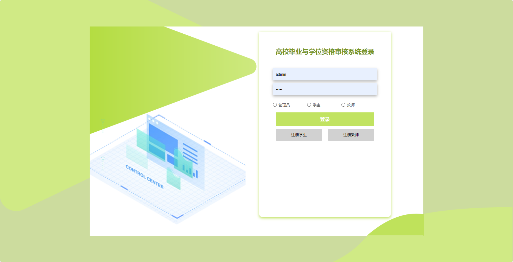
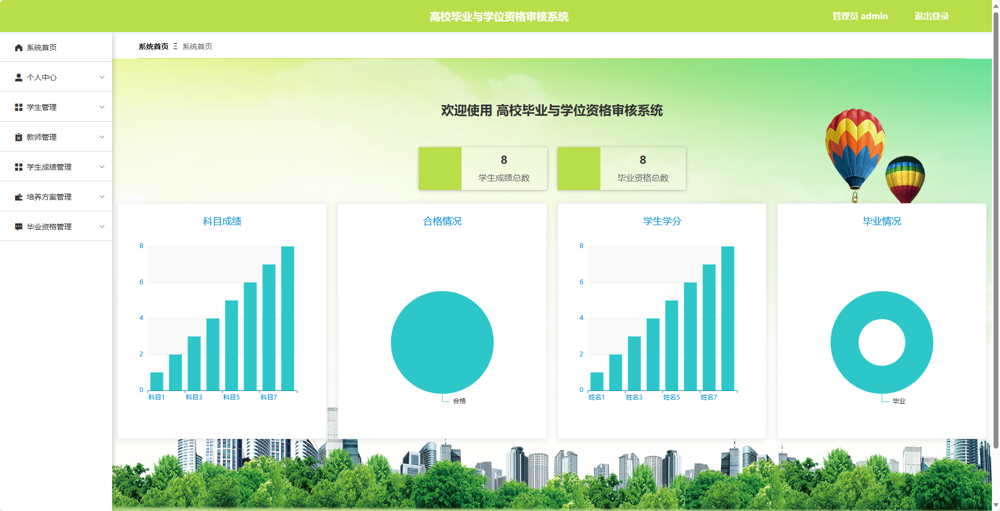
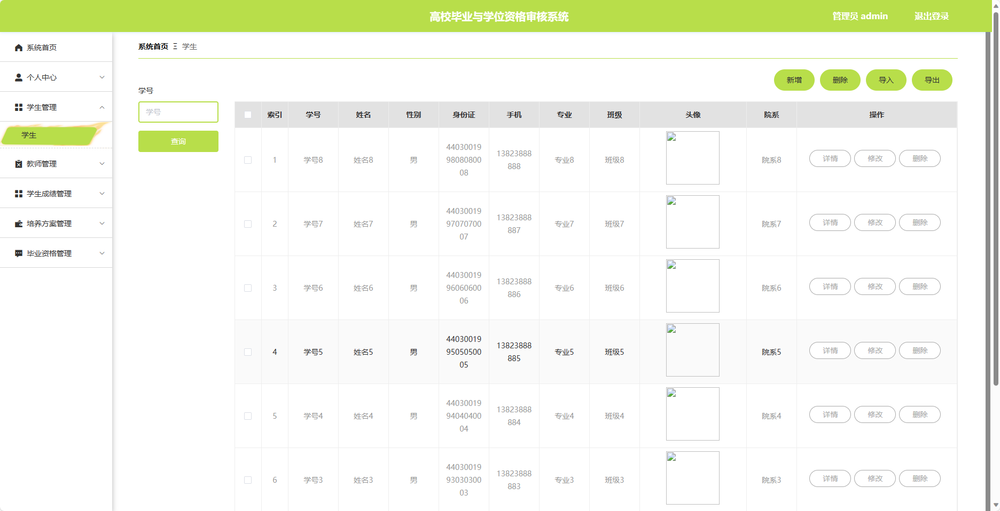
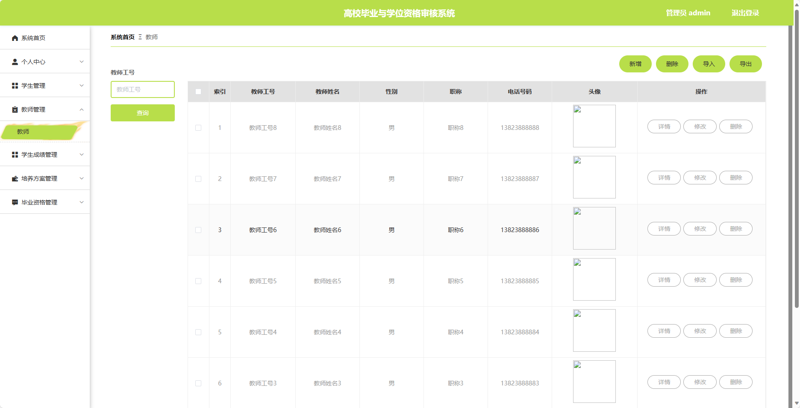
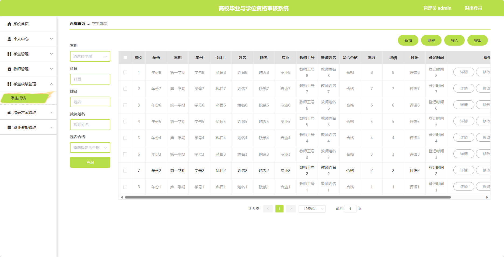
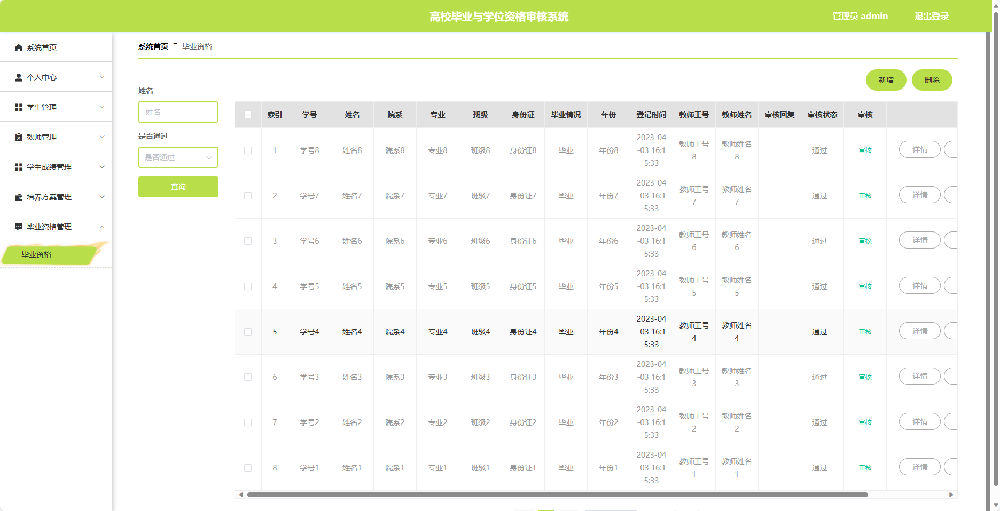
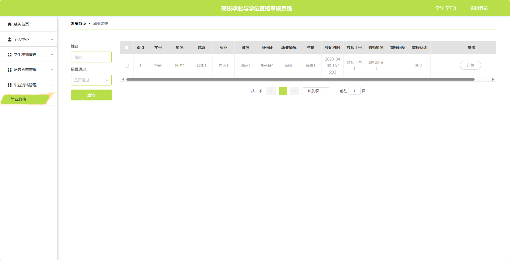

基于Springboot的高校毕业与学位资格审核系统（程序+论文）
=
### 完整代码获取地址：从戎源码网 ([https://armycodes.com/](https://armycodes.com/))
### 作者微信：19941326836  QQ：952045282 
### 承接计算机毕业设计、Java毕业设计、Python毕业设计、深度学习、机器学习
### 选题+开题报告+任务书+程序定制+安装调试+论文+答辩ppt 一条龙服务
### 所有选题地址https://github.com/nature924/allProject

一、项目介绍
---
基于Spring Boot框架实现的高校毕业与学位资格审核系统，系统包含三种角色：管理员、学生、教师，主要功能如下。
### 管理员：
1. 个人中心：管理员可以管理个人信息，包括修改密码、查看个人资料等。
2. 学生管理：管理员可以管理学生的基本信息，包括添加、编辑、删除学生信息等操作。
3. 教师管理：管理员可以管理教师的基本信息，包括添加、编辑、删除教师信息等操作。
4. 学生成绩管理：管理员可以管理学生的学习成绩，包括录入、修改、查询学生成绩等操作。
5. 培养方案管理：管理员可以管理学生的培养方案，包括制定、编辑、删除培养方案等操作。
6. 毕业资格管理：管理员可以审核学生的毕业资格。

### 学生：
1. 个人中心：学生可以管理个人信息，包括修改密码、查看个人资料等。
2. 学生成绩管理：学生可以查看自己的学习成绩，包括查询已修课程成绩、计算绩点等操作。
3. 培养方案管理：学生可以查看自己的培养方案，了解所需修读的课程、学分等信息。
4. 毕业资格管理：学生可以提交毕业资格申请材料，包括学分记录、实习报告等，进行审核操作。

### 教师：
1. 个人中心：教师可以管理个人信息，包括修改密码、查看个人资料等。
2. 学生成绩管理：教师可以录入和修改学生的学习成绩，对学生的学业情况进行管理。
3. 培养方案管理：教师可以制定和编辑学生的培养方案，包括设置课程要求、学分要求等。
4. 毕业资格管理：教师可以审核学生的毕业资格，包括学分要求、课程完成情况、实习报告等审核操作。

二、项目技术
---
- 编程语言：Java
- 数据库：MySQL
- 项目管理工具：Maven
- 前端技术：VUE、HTML、Jquery、Bootstrap
- 后端技术：Spring、SpringMVC、MyBatis

三、运行环境
---
- 操作系统：Windows、macOS都可以
- JDK版本：JDK1.8以上都可以
- 开发工具：IDEA、Ecplise、Myecplise都可以
- 数据库: MySQL5.7以上都可以
- Tomcat：任意版本都可以
- Maven：任意版本都可以

四、运行截图
---
### 论文截图：

### 程序截图：

